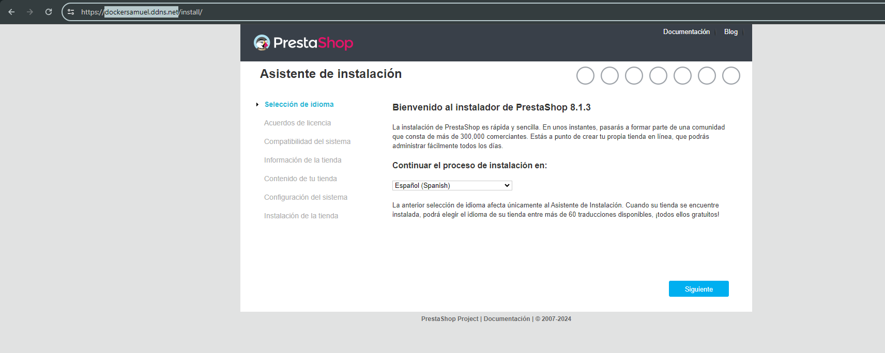

# 1-HTTPS-con-Let-s-Encrypt-Docker-y-Docker-Compose

En esta primera práctica de ejemplo se busca desplegar mediante un archivo **.yml** de **docker-compose** desplegar un sitio web de **prestashop** haciendo uso de **HTTPS-PORTAL** que es una imagen **Docker** que contiene un servidor **HTTPS** totalmente automatizado que hace uso de las tecnologías **Nginx** y **Let’s Enctrypt**. Los certificados **SSL** se obtienen y renuevan de Let’s Encrypt **automáticamente**.

 # Estructura de Directorios:

```
    │   ├── .env
    │   ├── docker-compose.yml

```

## 1. Pasos previos a realizar:

Antes de nada deberemos de realizar la instalación de **docker** y **docker-compose**, no sin antes lanzar este comando:

```
sudo apt update && sudo apt upgrade -y
```
Aquí procedo con la instalación de **docker.io**; paquete que proporciona la versión oficial de **Docker** y **docker-compose**:

```
sudo apt install docker.io docker-compose -y
```
Habilitamos **Docker**:
```
sudo systemctl enable docker
```
Y lo iniciamos por si no se ha llegado a empezar:

```
sudo systemctl start docker
```
Mediante el siguiente comando agregamos al usuario **ubuntu** al grupo **docker** para que pueda usar comandos de docker si hacer uso de **sudo**:

```
sudo usermod -aG docker ubuntu
```
Útil para que el usuario pueda cambiar de grupo sin tener que cerrar la sesión actual:

```
newgrp docker
```
 ## 2 Archivo de variables:

 Dentro de el archivo **.env** estás serán las únicas variables que hará falta en este caso tener:
 
```
MYSQL_ROOT_PASSWORD=root
MYSQL_DATABASE=prestashop
MYSQL_USER=ps_user
MYSQL_PASSWORD=ps_password

DOMINIO=dockersamuel.ddns.net
```
 ## 3 Explicación del archivo docker-compose.yml:

En la primera línea nos encontramos con el establecimiento de la **versión**, útil por si hay **incompatibilidades** con los servicios:

```
 version: '3.4'
```
`En este primer bloque el servicio que se define es el de mysql:`

1. Descargo la imagen de mysql, al no especificar **tag** baja la **latest**
2. Se define el comando "--default-authentication-plugin=mysql_native_password" para que **mysql** use es método especifico de **autenticación**:
3. Definición de puertos comentada para que no sea accesible desde fuera el **mysql**.
4. Definición de las variables de la base de datos.
5. volumen gestionado por docker.
6. Definición de red personalizada, en este caso como **backend**.
7. Reinicio del contenedor, incluso si se detiene por cualquier motivo de error, para garantizar su disponibilidad.
   
```
services:
  mysql:
    image: mysql
    command: --default-authentication-plugin=mysql_native_password
    #ports: 
    #  - 3306:3306
    environment: 
      - MYSQL_ROOT_PASSWORD=${MYSQL_ROOT_PASSWORD}
      - MYSQL_DATABASE=${MYSQL_DATABASE}
      - MYSQL_USER=${MYSQL_USER}
      - MYSQL_PASSWORD=${MYSQL_PASSWORD}
    volumes: 
      - mysql_data:/var/lib/mysql
    networks: 
      - backend-network
    restart: always
```
`En este segundo bloque el servicio que se define es el de phpmyadmin:`

1. Procedo a descargar la imagen de phpmyadmin, al no especificar **tag** baja la **latest**
2. Definición de puertos [máquina]:[contenedor_mysql] **8080** y **80**.
3. variable de entorno **PMA_ARBITRARY=1**: El valor **1** se utiliza para **permitir** que **phpMyAdmin** se conecte a cualquier servidor **MySQL** sin necesidad de especificar explícitamente la **dirección IP**.
4. Definición de red personalizada, en este caso como **backend** y **frontend**, para que el usuario frontal pueda acceder a la base de datos.
5. Reinicio del contenedor, incluso si se detiene por cualquier motivo de error, para garantizar su disponibilidad.
6. Se establece en el **depends_on** el nombre del servicio **mysql** para que no se ejecute este hasta que el otro este en estado de **ejecución**

```
  phpmyadmin:
    image: phpmyadmin
    ports:
      - 8080:80
    environment: 
      - PMA_ARBITRARY=1
    networks: 
      - backend-network
      - frontend-network
    restart: always
    depends_on: 
      - mysql
```
`En este tercer bloque el servicio que se define es el de prestashop:`

1. Procedo a descargar la imagen de prestashop, en este caso una imagen de nombre **prestashop/prestashop**, en esta caso traerá la **ultima versión**.
2. dentro de las variables se define el **DB_SERVER** para indicar mediante el **nombre del servicio** a que base de datos hacer referencia en cuanto a la **dirección** del servidor de la **base de datos**.
3. Se realiza un volumen gestionado por docker para el **directorio de datos** del **prestashop**.
4. Definición de red personalizada, en este caso como **backend** y **frontend**.
5. Reinicio del contenedor, incluso si se detiene por cualquier motivo de error, para garantizar su disponibilidad.
6. Se establece en el **depends_on** el nombre del servicio **mysql** para que no se ejecute este hasta que el otro este en estado de **ejecución**

```
  prestashop:
    image: prestashop/prestashop
    environment: 
      - DB_SERVER=mysql
    volumes:
      - prestashop_data:/var/www/html
    networks: 
      - backend-network
      - frontend-network
    restart: always
    depends_on: 
      - mysql
```
`En este cuarto bloque el servicio que se define es el de https-portal:`

1. En esta primera línea defino el **namespace** y la imagen que voy a bajar junto a la definición de su **tag**, en este caso **1**:
2. Definición de puertos [máquina]:[contenedor_mysql] **80** y **80**; **443** y **443**.
3. Reinicio del contenedor, incluso si se detiene por cualquier motivo de error, para garantizar su disponibilidad.
4. Dentro de la definción de las variables de entorno primeramente defino mi **nombre de dominio** redirigido a **http://prestashop:80**
5. En **STAGE** sirve para indicar el entorno de implementación, el cual esta establecido en **production**.
6. Definición de red personalizada, en este caso como **frontend**.

- **local**: Crea un certificado autofirmado para hacer pruebas en local.
- **staging**: Solicita un certificado de prueba a Let’s Encrypt para nuestro entorno de pruebas.
- **production**: Solicita un certificado válido a Let’s Encrypt. Esta opción sólo la usaremos para poner nuestro sitio web en producción.
   
```
  https-portal:
    image: steveltn/https-portal:1 # <-- al ser no verificada se le coloca el namespace
    ports:
      - 80:80
      - 443:443
    restart: always
    environment:
      DOMAINS: '${DOMINIO} -> http://prestashop:80'
      STAGE: 'production' # Don't use production until staging works
      # FORCE_RENEW: 'true'
    networks:
      - frontend-network
```

En esta parte de aquí se definen los volumenes de datos:

```
volumes:
  mysql_data:
  prestashop_data:
```

Y aqui las redes definidas:
```
networks: 
  backend-network:
  frontend-network:
```
 ## 4 Pruebas de funcionamiento:
 


 
